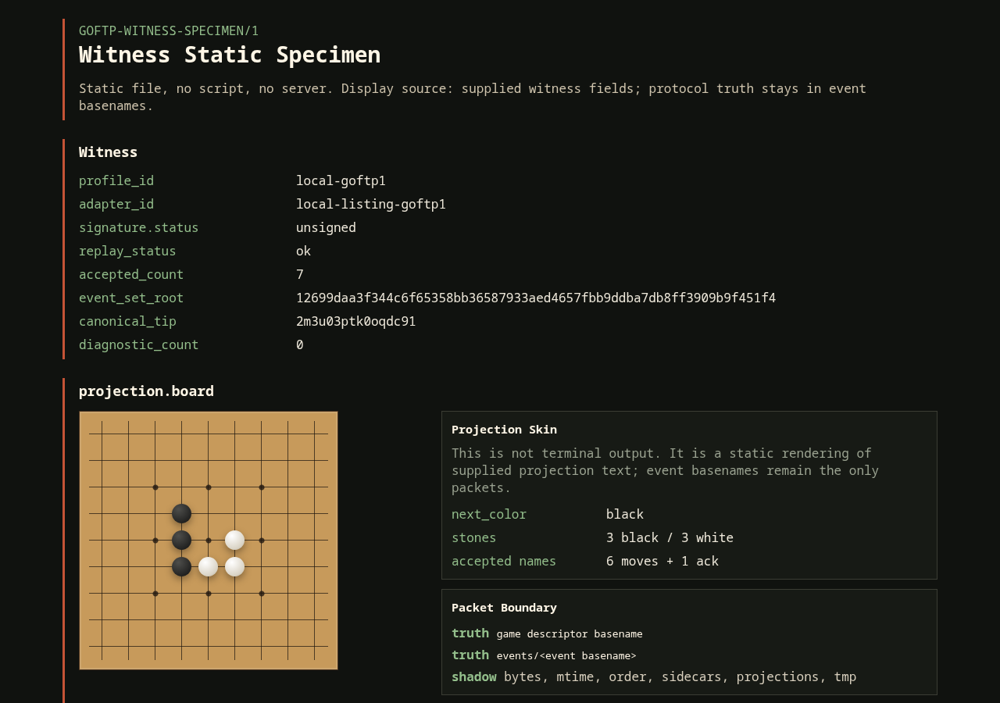
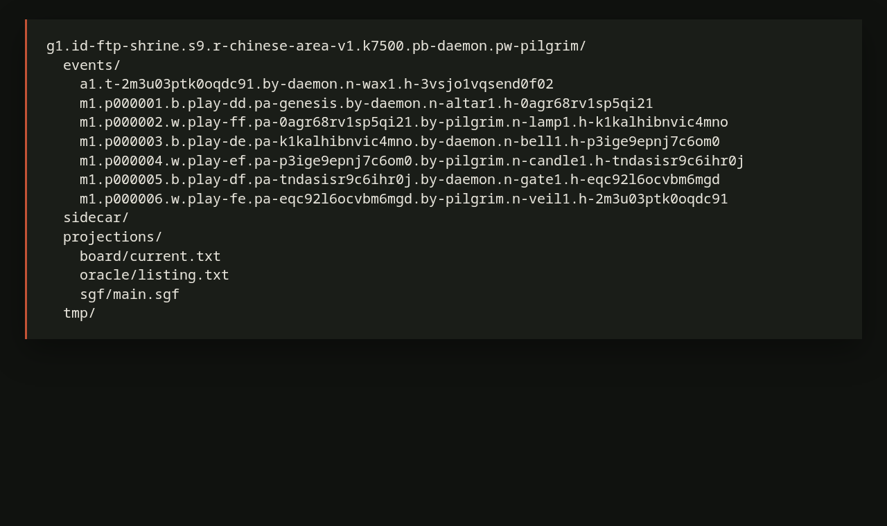
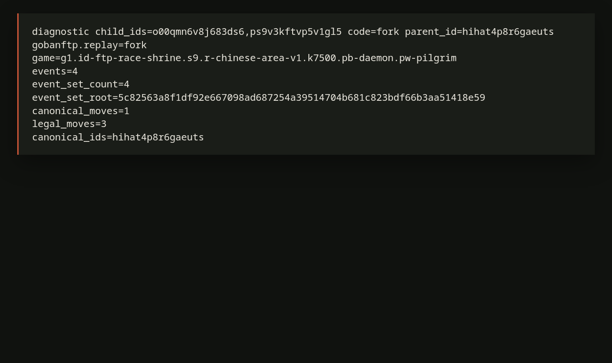
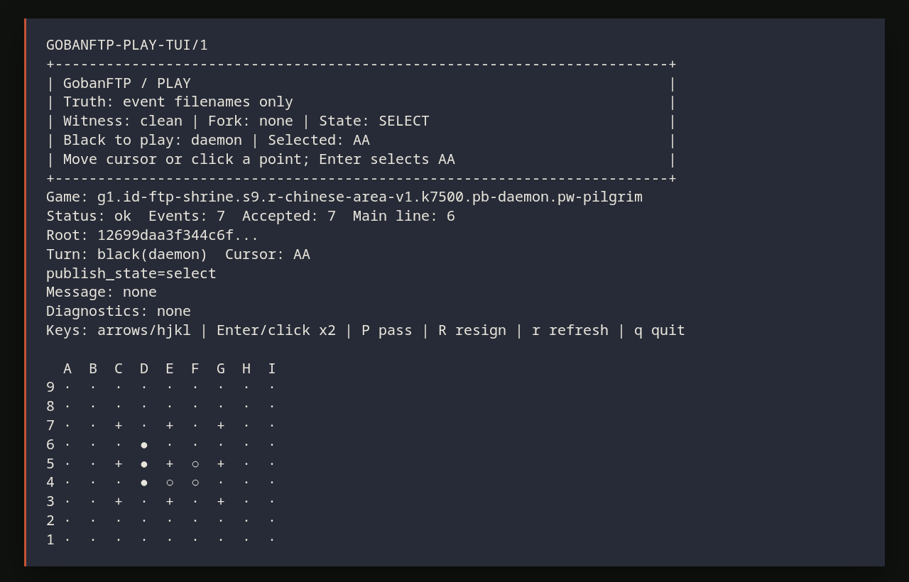

# GobanFTP

[English](README.md) | [简体中文](README.zh-CN.md) | [日本語](README.ja.md)

GobanFTP は、囲碁の一局をディレクトリの名前一覧から replay する実験です。
ファイル名が event です。


現在の beta リリース: `v1.1.0-beta.1/package 1.100_001`.

[ファイル名が event](#the-shape) · [fork を見る](#the-fork) ·
[なぜ作ったか](#why-this-exists) · [まず見るもの](#see-it-first) · [何に向いているか](#what-this-is-for) ·
[何ではないか](#not-for) · [3分で確認する](#three-minute-proof) ·
[端末で打つ](#terminal-play) · [静的標本ページ](#static-witness-specimen) ·
[契約](#the-contract)

<a id="the-shape"></a>

## ファイル名が event です

小さな一局は、名前だけでも表せます。

```text
g1.id-replay.s3.r-chinese-area-v1.k0.pb-alice.pw-bob/
  events/
    m1.p000001.b.play-aa.pa-genesis.by-alice.n-chain1.h-khjclcui7pejbv3m
    m1.p000002.w.play-bb.pa-khjclcui7pejbv3m.by-bob.n-chain2.h-bihb3re4k9hlucat
    m1.p000003.b.pass.pa-bihb3re4k9hlucat.by-alice.n-chain3.h-kcvtlonfje163p9q
```

読むべき move body はありません。ファイル名が event です。

game directory の basename は board size、rules、komi、players を表します。
`events/` の direct child basenames は、受理された events を表します。Replay はその名前に
含まれる parent id をたどります。file contents、mtime、listing order は replay input では
ありません。他のファイルがあってもかまいませんが、replay に入るのは受理された event
basenames だけです。

<a id="the-fork"></a>

## fork を見る

二つの publish attempt が同じ parent の下に別々の合法な child を作っても、listing は勝者を選びません。

```text
g1.id-replay.s3.r-chinese-area-v1.k0.pb-alice.pw-bob/
  events/
    m1.p000001.b.play-aa.pa-genesis.by-alice.n-forkleft.h-q65v2mhef9t3em7l
    m1.p000001.b.play-bb.pa-genesis.by-alice.n-forkright.h-o5g8u5cu913nedng
```

どちらの event も `pa-genesis` を親として主張します。Default replay は visible fork を報告します。
FTP、WebDAV、Git、DNS、filesystem listing order、mtime、file bodies、sidecar metadata で
勝手に一局を決めません。

<a id="why-this-exists"></a>

## なぜ作ったか

GobanFTP は `GOFTP/1` の protocol experiment であり、実行できる小さな proof specimen です。
確認したい主張は一つです。同じ game descriptor basename と、受理された同じ event basenames
が見えていれば、同じ一局を replay できるはずです。

出発点は playful protocol abuse / protocol bending です。FTP のような、名前を列挙できる保存先に
ふだんの仕事とは違うことをさせます。目的は普通の囲碁サーバではありません。信頼しにくいが
列挙できる保存先で、replay boundary を見える形にすることです。

file contents、size、mtime、listing order、sidecars、projections、SGF、HTML、terminal output、
source art は一局を調べる助けになりますが、一局を決めません。

これは普通の囲碁サーバでも、hosted Web UI でも、本番用の安全システムでもありません。

<a id="see-it-first"></a>

## まず見るもの



Replay のあと、同じ受理された名前を board と witness page に projection できます。

ブラウザで直接開けます。

```text
examples/static/witness-specimen.html
```

script も server も network fetch もありません。replay から生成された witness fields と
board projection を表示するだけです。このページは一局の source ではありません。
replay は game descriptor と event filenames から来ます。

<a id="what-this-is-for"></a>

## 何に向いているか

GobanFTP は、次のものを見たいときに向いています。

- 公開された game descriptor と event filenames からの決定的な replay
- directory listing の形をした event log
- writer が競合したときに見える fork diagnostics
- 信頼しにくいが列挙できる保存先の protocol boundary
- 実行できる protocol art

<a id="not-for"></a>

## 何ではないか

GobanFTP は次のものではありません。

- 通常の囲碁サーバ
- hosted Web UI
- 本番用の認証システム
- 本番 FTP の安全性証明
- DNS resolver や provider 連携
- 完全な scoring/result system

<a id="three-minute-proof"></a>

## 3分で確認する

必要なものは Perl 5.34+ と `make` です。この local check には FTP サーバーは不要です。
repository 内の fixture を使います。

```sh
perl Makefile.PL
make
make test
prove -lr t/showcase-demo.t t/showcase-v1_1.t
perl -Ilib script/gobanftp showcase --out showcase-v1.1
```

showcase test は、通常の一局を replay できること、race が見える fork として残ること、
表示層、file body、metadata が一局を勝手に決めないことを確認します。

`gobanftp showcase --out showcase-v1.1` は repository 内の fixture だけから、
local で直接開ける static directory を生成します。これは local inspection 用の
表示出力であり、hosted Web UI でも replay input でもありません。

clean fixture を直接実行します。

```sh
GOBANFTP_ROOT=examples/fixtures/ftp-shrine \
perl -Ilib script/gobanftp play --once g1.id-ftp-shrine.s9.r-chinese-area-v1.k7500.pb-daemon.pw-pilgrim
```

このような盤面が出ます。

```text
gobanftp.play=ok
events=7
canonical_moves=6
worldline.status=main
  a b c d e f g h i
9 . . . . . . . . .
8 . . . . . . . . .
7 . . . . . . . . .
6 . . . B . . . . .
5 . . . B . W . . .
4 . . . B W W . . .
3 . . . . . . . . .
2 . . . . . . . . .
1 . . . . . . . . .
```

race fixture も実行します。

```sh
GOBANFTP_ROOT=examples/fixtures/ftp-race-shrine \
perl -Ilib script/gobanftp replay g1.id-ftp-race-shrine.s9.r-chinese-area-v1.k7500.pb-daemon.pw-pilgrim
```

この fixture では exit code `3` が期待値です。クラッシュではなく、race が fork
として残ったという意味です。

```text
diagnostic ... code=fork parent_id=hihat4p8r6gaeuts
gobanftp.replay=fork
events=4
event_set_count=4
canonical_moves=1
legal_moves=3
canonical_ids=hihat4p8r6gaeuts
```

## 先に知る五つの言葉

- event filename: `events/` の下にある、着手または確認を表す名前です。
- replay: その名前から一局を検証し、盤面を再構成する処理です。
- fork: 同じ親に複数の有効な子が出たときに残る、見える分岐です。
- projection: replay の結果から生成される表示です。盤面 text、SGF、HTML などです。
- witness: 人や test が確認するための証拠です。一局の truth そのものではありません。

## さらに三つの見方

静的標本ページは上にあります。ここでは同じ一局を別の三つの角度から見ます。
replay の入力は、game directory の名前と `events/` 直下の event filenames だけです。

### 1. 一局はディレクトリとして見える



外側のディレクトリ名が一局を表します。`events/` の下の名前が着手を表します。
`sidecar/`、`projections/`、`tmp/` は説明、表示、公開途中の作業には使えますが、
replay を決めません。

### 2. race は fork として残る



二つの着手が同じ親から同時に出たとき、listing order に勝者を選ばせません。
GobanFTP は fork を表示し、既定の replay ではそこで止まります。

### 3. terminal でも打てる



`play --tui` はローカル端末の input/display layer です。keyboard と、対応端末での
SGR mouse は、まず candidate を選びます。二度目の Enter/click で publish を確認します。

<a id="terminal-play"></a>

## 端末で打つ

サンプルを一時ディレクトリにコピーして試せます。

```sh
tmp="$(mktemp -d)"
src="$(find examples/fixtures/ftp-shrine -maxdepth 1 -type d -name 'g1.id-ftp-shrine*' | head -n 1)"
cp -R -- "$src" "$tmp/"
game="$tmp/$(basename "$src")"
perl -Ilib script/gobanftp play --tui "$game"
```

状態は明示的に進みます。

```text
select -> confirm -> publishing_locked -> published
```

操作は次の通りです。

```text
arrow keys / hjkl  cursor move (Vim style)
Enter              select; same point again confirms publish
mouse click        SGR mouse capable terminals only; same point again confirms
P                  pass
R                  resign
r                  refresh
q                  quit
```

`play --tui` は rules、roots、diagnostics、event acceptance を所有しません。同じ
replay と publish callbacks の上にある local input/display layer です。

read-only な live-over-listing 観察には、bounded な `watch --live` または
`play --live` を使えます。

```sh
perl -Ilib script/gobanftp watch --live --max-polls 3 --interval 1 "$game"
perl -Ilib script/gobanftp watch --live --compact --max-polls 3 --interval 1 "$game"
```

live mode は、見える fork や validation diagnostics があっても polling を続けます。
勝者を選ばず、move も publish しません。`events/` を繰り返し列挙し、名前から replay し、
現在の witness surface を表示するだけです。`--compact` は event-set と worldline fields を
残しつつ、board drawing を省略します。

<a id="static-witness-specimen"></a>

## 静的標本ページ

`examples/static/witness-specimen.html` は直接開く static specimen です。script も
network fetch も server process も hosted UI behavior もありません。

visual board は raw projection text の横に置かれた projection view です。すでに生成された
fields を表示できますが、event を valid にすることはできません。

<a id="the-contract"></a>

## 契約

`GOFTP/1` が replay 入力として採用するものは二つだけです。

| Truth | Meaning |
| --- | --- |
| game descriptor directory basename | 一局、rules、players を表す |
| direct child basenames under `events/` | 着手と確認を表す |

それ以外は replay から見ると shadow です。

| Shadow | Examples |
| --- | --- |
| file data | entry type、bytes、size |
| server metadata | mtime、listing order、server order |
| FTP metadata | `RETR`、`SIZE`、`MDTM` |
| WebDAV metadata | ETag、Last-Modified、locks、resource bodies |
| helper paths | `sidecar/**`、`projections/**`、`tmp/**` |
| generated surfaces | SGF、static HTML、terminal output、source art |

すべての projection を消しても、一局は replay できます。file contents、mtime、
listing order を変えても replay は変わりません。event filename を変えたら、
一局は変わるか、その event は拒否されます。

event id は file contents からではなく、canonical filename context から作られます。
既知の play 全体は DAG です。network race は FTP や WebDAV の ordering に隠れず、
visible fork になります。

protocol names は小さな public alphabet を使います。

```text
[a-z0-9._-]
```

secret を filename に置いてはいけません。filenames は public です。

## Shrine Fixture（標本）

`ftp-shrine` は、repository 内でそのまま読める fixture です。live server ではなく、
説明とテストのための標本です。

```text
g1.id-ftp-shrine.s9.r-chinese-area-v1.k7500.pb-daemon.pw-pilgrim/
  events/
    m1.p000001.b.play-dd.pa-genesis.by-daemon.n-altar1.h-0agr68rv1sp5qi21
    ...
  sidecar/
  projections/
    board/current.txt
    oracle/listing.txt
    sgf/main.sgf
  tmp/
```

読み方はこの通りです。

```text
g1.../         names the game
events/       names the moves and acknowledgements
sidecar/      説明はできるが、決定はしない
projections/  表示はできるが、決定はしない
tmp/          publish 中に残るもの
```

最初に見る file と directory です。

```text
examples/fixtures/ftp-shrine/README.md
examples/fixtures/ftp-shrine/g1.id-ftp-shrine.s9.r-chinese-area-v1.k7500.pb-daemon.pw-pilgrim/events/
examples/fixtures/ftp-shrine/g1.id-ftp-shrine.s9.r-chinese-area-v1.k7500.pb-daemon.pw-pilgrim/projections/oracle/listing.txt
examples/fixtures/ftp-shrine/g1.id-ftp-shrine.s9.r-chinese-area-v1.k7500.pb-daemon.pw-pilgrim/projections/board/current.txt
examples/fixtures/ftp-shrine/g1.id-ftp-shrine.s9.r-chinese-area-v1.k7500.pb-daemon.pw-pilgrim/projections/sgf/main.sgf
oracle/goban.pl
```

`projections/oracle/listing.txt` は reader-facing transcript です。`NLST events/`
が event basenames を露出し、`RETR`、`SIZE`、`MDTM` は `GOFTP/1` replay の外に
残ることを見せます。

SGF は witness です。正本ではありません。

## いま動く範囲

v1.1.0-beta.1/package 1.100_001 で実装済みの範囲です。

- 中核: filename grammar、event ids、`event_set_root`、DAG replay、
  `chinese-area-v1` rules、SGF、ack-assisted fork recovery。
- 保存先: local、FTP、WebDAV、read-only Git tree、read-only DNS record-file
  admission。
- 表示と入力: `play --tui`、read-only `watch --live` / `play --live`
  observers、witness text/html/terminal、projections、direct-open static
  specimen、executable source-art oracle smoke。
- profiles: unsigned `GOFTP/1`、declared substrate profiles、explicit
  signed-HMAC witness/preflight checks。
- 検証材料: showcase check、attack fixtures、cross-substrate golden vectors、
  profile publish fixtures。

v1.1.0-beta.1/package 1.100_001 の範囲は次の通りです。

- `git-tree-goftp1` は runtime で read-only です。publish commands は storage
  boundary で失敗します。
- `dns-record-goftp1` はローカル、または明示的に指定された record file input の
  read-only normalization です。live DNS を問い合わせず、AXFR を実行せず、
  DNSSEC を信頼根拠として扱わず、provider APIs を呼ばず、records を publish しません。
- TTL、answer order、cache age、DNSSEC status、authoritative server identity、
  provider metadata は consensus の外です。
- static HTML の witness 出力は hosted Web UI ではありません。`--surface terminal`
  は local `play --tui` input/display layer ではありません。
- verifier-local HMAC key files、explicit verifier-supplied lifecycle status、
  fixture publish-token/preflight semantics は production key lifecycle、
  production auth、real writer authorization ではありません。
- final scoring/result events は `GOFTP/1` の外です。

FTP listing-shadow public poison-vector coverage は fixture/listing 上の検証材料だけです。
`RETR`、`SIZE`、`MDTM`、live FTP auth、live FTP integrity、production FTP deployment
safety は扱いません。`ftp-goftp1` tmp+rename publish path は別に declared
され、mock FTP tests で扱われます。Live provider smoke は P1 fixture-local
review scope の外に残ります。

この release の signed-HMAC material は verifier-local fixture/preflight の検証材料
です。production writer authorization でも production key lifecycle でもありません。
`signed-hmac-goftp1` は明示的に選んだ profile の検査であり、unsigned `GOFTP/1`
replay を置き換えるものではありません。

Unsigned `GOFTP/1` は有効なままです。signed/auth profile は、その explicit profile
が選ばれた場合だけ events を reject できます。sidecar signatures は unsigned replay
を変えません。

## Source Art の境界

`oracle/goban.pl` は囲碁盤のように見えます。それでも実行できる Perl であり、
テスト対象 module を呼び出す wrapper です。

```sh
perl -c oracle/goban.pl
perl oracle/goban.pl --smoke
```

期待される出力には次が含まれます。

```text
oracle/goban.pl syntax OK
gobanftp.oracle=ok
rules.move=ok
```

source art は表示用の wrapper です。filename grammar、event id、DAG replay、
rule legality、storage behavior、SGF、diagnostics は通常の module 側にあります。

```text
source art / C / asm / Web UI / TUI -> replay の真実を変えられません
```

## 動かす

Runtime requirements:

```text
Perl 5.34+
Digest::SHA
HTTP::Tiny
MIME::Base64
Net::FTP
```

Build and test requirements:

```text
make
```

Optional:

```text
Inline
Inline::C
```

通常の確認:

```sh
perl Makefile.PL
make
make test
```

ローカルで全体を確認:

```sh
prove -lr t
```

一時的な game を作ります。

```sh
tmp="$(mktemp -d)"
export GOBANFTP_ROOT="$tmp"

perl -Ilib script/gobanftp create-game --id demo --size 9 --black alice --white bob
perl -Ilib script/gobanftp publish-move g1.id-demo.s9.r-chinese-area-v1.k7500.pb-alice.pw-bob aa
perl -Ilib script/gobanftp publish-move g1.id-demo.s9.r-chinese-area-v1.k7500.pb-alice.pw-bob play-bb
perl -Ilib script/gobanftp play --once g1.id-demo.s9.r-chinese-area-v1.k7500.pb-alice.pw-bob
```

採用される packet を見ます。

```sh
find "$GOBANFTP_ROOT" -path '*/events/*' -exec basename {} \; | sort
```

この名前群が一局です。file contents ではありません。

## 保存先

既定の保存先は local filesystem です。FTP、read-only Git tree、read-only DNS
record-file admission、WebDAV は、event file contents、blob bytes、resource bodies、
DNS transport metadata を読まずに、同じ「名前一覧を先に読む」境界へ正規化されます。
共通する規則は単純です。replay は列挙できる名前だけを読み、file contents や remote
metadata は読みません。
local argument が path の場合、最後の path component だけが game descriptor basename として使われます。その basename は有効な GOFTP game descriptor でなければなりません。

FTP mode:

```text
GOBANFTP_STORE=ftp
GOBANFTP_FTP_HOST
GOBANFTP_FTP_USER
GOBANFTP_FTP_PASSWORD
GOBANFTP_FTP_ROOT
GOBANFTP_FTP_PORT
GOBANFTP_FTP_PASSIVE
GOBANFTP_FTP_TIMEOUT
GOBANFTP_FTP_PUBLISH_MODE
```

WebDAV mode:

```text
GOBANFTP_STORE=webdav
GOBANFTP_WEBDAV_URL
GOBANFTP_WEBDAV_USER
GOBANFTP_WEBDAV_PASSWORD
GOBANFTP_WEBDAV_TOKEN
GOBANFTP_WEBDAV_TIMEOUT
GOBANFTP_WEBDAV_CLASS
GOBANFTP_WEBDAV_PUBLISH_MODE
```

認証付き WebDAV URL は `https://` が必須です。Basic と Bearer の認証情報は `http://` では拒否されます。認証なしの `http://` は mock/local の平文 fixture 用に残しているもので、production transport-safety mode ではありません。

Git tree mode:

```text
GOBANFTP_STORE=git-tree
GOBANFTP_GIT_REPO
GOBANFTP_GIT_TREEISH
GOBANFTP_GIT_BINARY
```

DNS record mode:

```text
GOBANFTP_STORE=dns-record
GOBANFTP_DNS_RECORD_FILE
GOBANFTP_DNS_OWNER_SUFFIX
```

Git tree replay は `<treeish>:<game>/events` から direct child names を読みます。
blob bytes、commit metadata、refs、branches、tags、sidecars、projections、tmp
entries は無視します。Git tree mode は read-only であり、publish commands は
storage boundary で失敗します。

DNS record admission は、runtime で `GOBANFTP_DNS_RECORD_FILE` として与えられた
ローカル、または明示的に指定された record-file presentation だけを読みます。これは
live DNS resolver、AXFR client、DNSSEC validator、provider API client、dynamic
update client、publishing backend ではありません。TTLs、record order、answer
order、cache age、DNSSEC status、authoritative server identity、provider metadata
は `event_set_root` の前に無視されます。

WebDAV replay は `PROPFIND Depth: 1` で `events/` を読み、direct href basenames
だけを使います。publishing は `tmp/` に zero-byte temporary resource を書き、
`events/<event-name>` へ move し、fresh `PROPFIND` で visibility を確認します。

`ftp-goftp1` の default publishing は、zero-byte temporary entry を `tmp/`
の下へ upload し、`RNTO` で `events/<event-name>` へ rename し、listing で
visibility を確認します。`GOBANFTP_FTP_PUBLISH_MODE=mkdir` は directory-shaped alternative として
残ります。

Projection writes は local-only です。nonlocal `project` と `sgf --write` は拒否
されます。plain `sgf`、`verify`、`replay`、`play`、`watch` は nonlocal listings
を読めます。

## Release Checks

主な確認コマンド:

```sh
prove -lr t/showcase-demo.t
prove -lr t
```

現在の beta source gate は `docs/V1_1_RELEASE_GATE.md` にあります。
`v1.1.0-beta.1/package 1.100_001` の fixture-local checks を記録し、tag、
push、upload、deploy、distribution command を明示的に省略しています。

public beta release notes は `docs/V1_1_RELEASE_NOTES.md` にあります。historical
`v1.0/P14` release records は `docs/P14_RELEASE_GATE.md` と
`docs/P14_RELEASE_MANIFEST_AND_TAG_PLAN.md` に残しますが、現在の beta
release/tag identity ではありません。

P1 fixture-local review scope では、live provider smoke、distribution
packaging、tag、upload、deploy は P1 の外にあります。これらには後続の
separate maintainer-run gate が必要です。

## License

別途明記されていない限り、この repository の code、protocol documentation、
examples、fixtures、test vectors、projections、static specimens は Apache License,
Version 2.0 の下で提供されます。

Copyright 2026 GobanFTP contributors.

この license が対象にするのは repository の内容です。第三者の FTP、WebDAV、DNS、
Git、その他の system へアクセス、テスト、publish する許可ではなく、production
security certification でもありません。

## Release Invariants

GobanFTP v1.0 は game server ではありません。複数の「名前を列挙できる保存先」から、
同じ event basenames を使って一局を replay する Perl 実装です。

release source の確認では、profile、adapter、attack fixture、witness 出力、
signed-HMAC profile、表示出力を次の項目で比較します。

```text
same event basenames
same event_set_root
same DAG
same canonical prefix
same board projection
same SGF
same diagnostic class for the same logical failure where observable
```

必要な不変条件:

```text
modify mtime       -> unchanged
modify file bytes  -> unchanged
modify LIST order  -> unchanged
add sidecar        -> unchanged
change basename    -> changed
bad signed profile -> rejected by that signed profile
source art / C / asm / Web UI / TUI -> replay の真実を変えられません
```

`v0.1` は `GOFTP/1` consensus boundary を固定しました。最初の `v1.0/P14`
package 1.000 release source は、その境界を複数の substrate にまたがる検証の
出発点にしました。現在の beta release line は `v1.1.0-beta.1/package 1.100_001`
です。

## 資料

よく使う入口です。

```text
Showcase:     docs/SHOWCASE.md
Protocol:     docs/PROTOCOL.md
Profiles:     docs/PROFILES.md
Grammar:      docs/GRAMMAR.md
Attacks:      docs/ATTACKS.md
v1.1 gate:    docs/V1_1_RELEASE_GATE.md
v1.1 notes:   docs/V1_1_RELEASE_NOTES.md
v1.0 DoD:     docs/V1_DOD.md
v1.0 history: docs/P14_RELEASE_GATE.md
Algorithms:   docs/ALGORITHMS.md
Rules:        docs/RULES.md
Diagnostics:  docs/DIAGNOSTICS.md
Source art:   docs/SOURCE_ART.md
Build:        docs/BUILD.md
CLI:          docs/CLI.md
Roadmap:      docs/ROADMAP.md
Decisions:    docs/DECISIONS.md
```

repository map:

```text
.
|-- README.md              English README
|-- README.zh-CN.md        Simplified Chinese README
|-- README.ja.md           this text
|-- docs/                  protocol, roadmap, decisions, release records
|-- oracle/goban.pl        executable source-art smoke wrapper
|-- lib/GobanFTP/          Perl implementation modules
|-- script/gobanftp        CLI entry point
|-- examples/fixtures/     browsable mirrored games
`-- t/                     tests and attack galleries
```

プロトコル挙動を変える前に読むもの:

1. `docs/PROTOCOL.md`
2. `docs/ARCHITECTURE.md`
3. `docs/ALGORITHMS.md`
4. `docs/RULES.md`
5. `docs/ROADMAP.md`
6. `docs/DECISIONS.md`

新しい profile や rule を追加する前に、既存の protocol 文書を確認してください。
